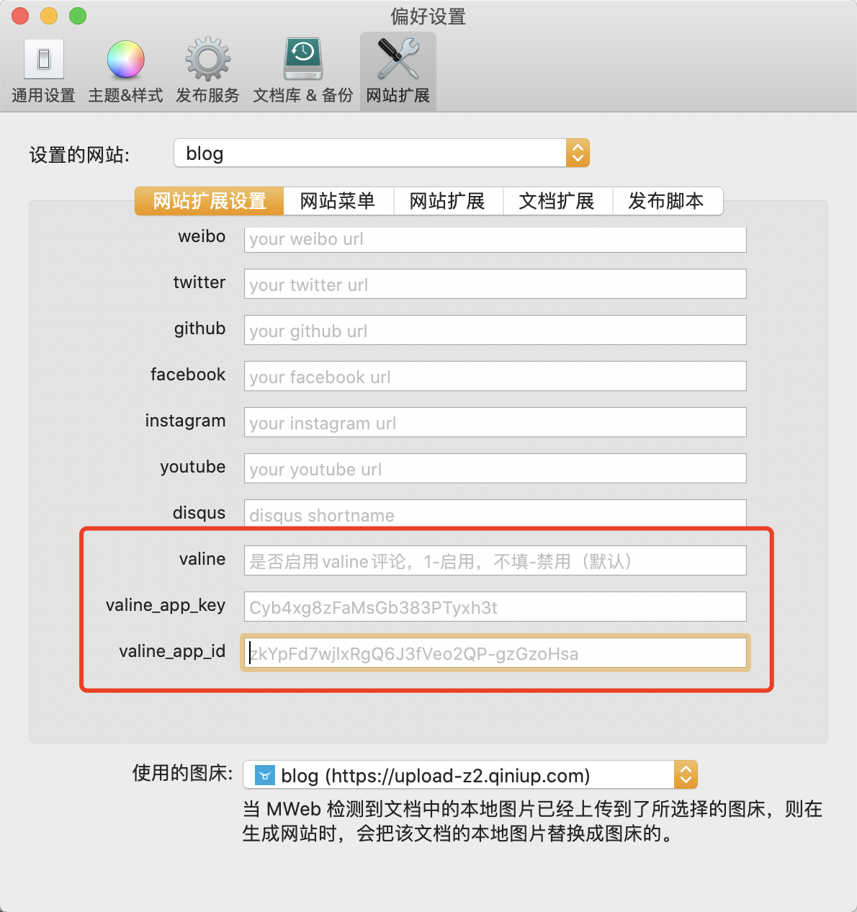

# MWeb feiffy-vgist Theme

MWeb 网站主题 feiffy-vgist。  

[演示网站（Demo Site）](http://test.feiffy.cc/blog/index.html)  

## 安装 (Install)

```
cd ~/Library/Containers/com.coderforart.MWeb/Data/Documents/themes/SiteThemes
git clone https://github.com/feiffy/feiffy-vgist.git
```

## 使用方法（Usage）

主题使用请参考文档：https://zh.mweb.im/mweb-static-blog.html

## 额外功能

### 启用 valine 无后端评论系统

此模板新增了 valine 无后端评论系统的功能，默认是未开启的。

如果需要开启，很简单，打开网站设置，看到新增了三个变量，`valine` 值为1则开启，`app_id` 和 `app_key` 则需要到 https://leancloud.cn/ 申请一个应用，获取 `appKey` 和 `appId`，然后添加到这里就好。valine 详细教程请参考：https://valine.js.org/quickstart.html

